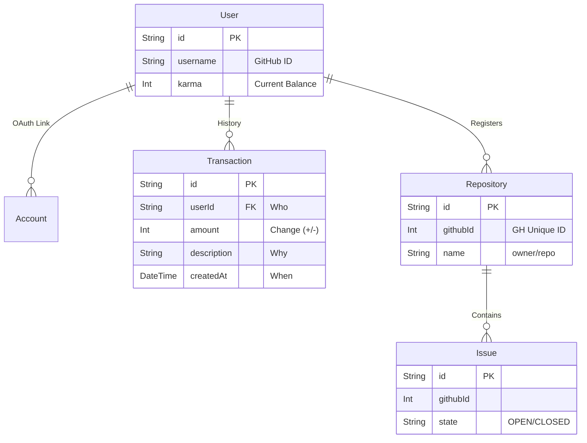

# Chapter 3: The Ledger - Database Design

## 3.1 Overview
Our database is the single source of truth for Karma. If it's not in the DB, it didn't happen.
We use **PostgreSQL** hosted on Supabase, managed via **Prisma**.

## 3.2 The ER Diagram
The relationship between Users, Karma, and Repositories.

## 3.3 Key Models Deep Dive

### The `User` Model
The protagonist of our story.
-   **`karma`**: An integer representing the *current* balance. Default is 0.
-   **`username`**: Synced from GitHub.

### The `Transaction` Model (The Ledger)
Note: We originally considered a `fromUser` -> `toUser` model, but switched to a **Single Ledger** model.
Why? Because Karma isn't always a direct transfer. System bonuses, daily logins (maybe?), or penalties don't have a "sender".

-   **`userId`**: The affected user.
-   **`amount`**: Positive for earnings, negative for spending (Boosting).
-   **`description`**: E.g., "Solved issue #123", "Boosted repo X".

### The `Repository` Model
We only store what we need to display cards. Use the `githubId` to fetch fresh details (stars, language) from GitHub API dynamically if needed to keep our DB light.

## Column: To Pool or Not To Pool?
> Serverless functions (like Vercel) are notorious for exhausting database connections.
>
> We use a **Dynamic Connection Strategy**:
> -   **Production**: We connect to Supabase's **Transaction Pooler** (port 6543) for the app.
> -   **Migrations**: We use the **Direct Connection** (port 5432) because Prisma Migrate needs lock access.
>
> This setup ensures our app scales even if 1,000 users hit the dashboard at once (we wish!).

---
*End of Architecture Section.*
