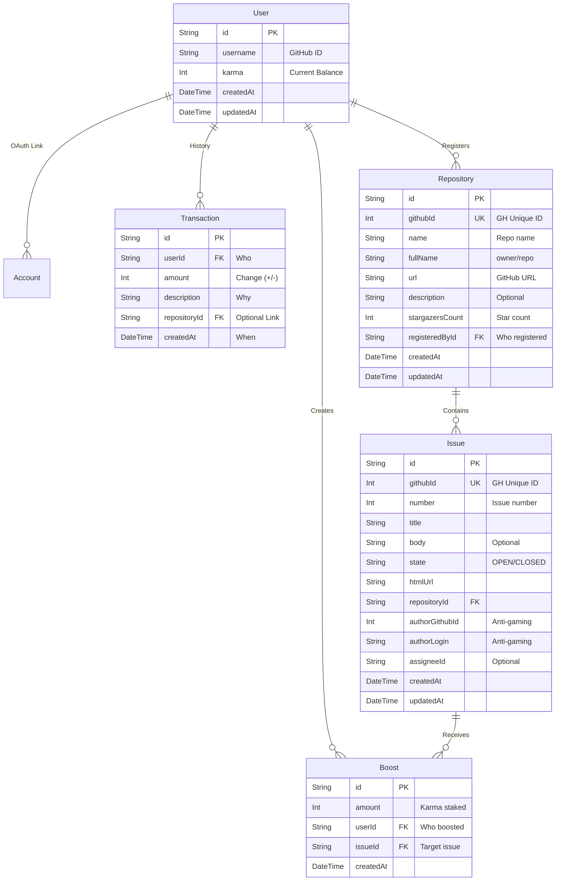

# Chapter 3: The Ledger - Database Design

## 3.1 Overview
Our database is the single source of truth for Karma. If it's not in the DB, it didn't happen.
We use **PostgreSQL** hosted on Supabase, managed via **Prisma**.

## 3.2 The ER Diagram
The relationship between Users, Karma, Repositories, Issues, and Boosts.

## 3.3 Key Models Deep Dive

### The `User` Model
The protagonist of our story.
-   **`karma`**: An integer representing the *current* balance. Default is 0.
-   **`username`**: Synced from GitHub (unique).
-   **`registeredRepositories`**: Repositories this user has registered on GitGivers.

### The `Transaction` Model (The Ledger)
Note: We originally considered a `fromUser` -> `toUser` model, but switched to a **Single Ledger** model.
Why? Because Karma isn't always a direct transfer. System bonuses, daily logins (maybe?), or penalties don't have a "sender".

-   **`userId`**: The affected user.
-   **`amount`**: Positive for earnings, negative for spending (Boosting, Registration).
-   **`description`**: E.g., "Solved issue #123", "Boosted repo X", "Registered repository Y".
-   **`repositoryId`**: Optional link to repository if transaction is repo-related.

### The `Repository` Model
Tracks repositories registered on GitGivers.

-   **`githubId`**: Unique GitHub repository ID (used for API lookups).
-   **`fullName`**: The `owner/repo` format for display.
-   **`registeredById`**: Links to the User who paid 500 Karma to register this repo.
-   **`stargazersCount`**: Cached star count (can be refreshed from GitHub API).
-   We only store what we need to display cards. Use the `githubId` to fetch fresh details (language, latest commits) from GitHub API dynamically if needed to keep our DB light.

**Registration Cost**: 500 Karma (prevents spam, validates commitment)

### The `Issue` Model
Represents GitHub issues that have been synced to GitGivers.

-   **`githubId`**: Unique GitHub issue ID.
-   **`number`**: Issue number within the repository (#123).
-   **`state`**: Current state (open, closed).
-   **`repositoryId`**: Links to parent Repository.
-   **`authorGithubId` / `authorLogin`**: **Anti-Gaming Fields**
    -   Tracks who created the issue on GitHub
    -   Used to prevent issue authors from claiming their own bounties
-   **`assigneeId`**: Optional field for future assignee tracking.

### The `Boost` Model (NEW)
Represents Karma stakes placed on issues by users.

-   **`amount`**: How much Karma the user staked.
-   **`userId`**: Who placed the boost.
-   **`issueId`**: Which issue is being boosted.
-   **`createdAt`**: When the boost was created.

**Boost Mechanics**:
-   Users can boost any registered issue to increase its reward
-   Boosted Karma is immediately deducted from user's balance
-   When issue is solved, solver receives: Base Reward + All Boosts
-   Boosts cannot be cancelled (skin in the game)

## 3.4 Anti-Gaming Implementation

The `Issue` model includes anti-gaming fields to prevent exploitation:

1.  **Issue Author Protection**: 
    -   `authorGithubId` and `authorLogin` are captured during sync
    -   Webhook logic will verify solver ≠ issue author

2.  **Repository Owner Protection**:
    -   Solver cannot be the repository owner
    -   Verified through GitHub API ownership check

3.  **No Self-Dealing**:
    -   Combining the above: You can't solve your own issues in your own repos
    -   Ensures Karma flows between different contributors

## Column: To Pool or Not To Pool?
> Serverless functions (like Vercel) are notorious for exhausting database connections.
>
> We use a **Dynamic Connection Strategy**:
> -   **Production**: We connect to Supabase's **Transaction Pooler** (port 6543) for the app.
> -   **Migrations**: We use the **Direct Connection** (port 5432) because Prisma Migrate needs lock access.
>
> This setup ensures our app scales even if 1,000 users hit the dashboard at once (we wish!).

---

## Implementation Status

✅ **Fully Implemented**:
- User model with Karma tracking
- Transaction ledger system
- Repository registration with ownership verification
- Issue synchronization with anti-gaming fields
- Boost system for issue prioritization

🔲 **Planned**:
- Webhook-based automatic Karma payout on PR merge
- Assignee tracking and monopoly prevention
- Daily "0-star pickup" feature

*Next Chapter: How do we calculate Karma? The Core Logic.*
