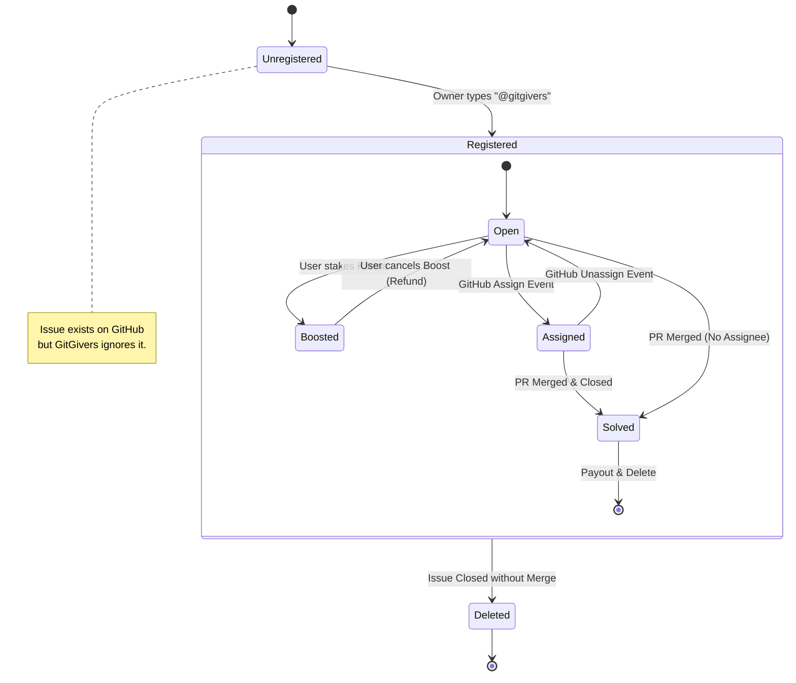

# Chapter 4: The Logic of Karma (Core Mechanics)

This is the heart of GitGivers. This is how we quantify gratitude.
We are not just counting lines of code; we are attempting to measure *impact* and *helpfulness* in a "Lonely Repo" economy.

> **Implementation Status**: This chapter describes both implemented features (✅) and planned features (🔲). Check each section for current status.

## 4.1 The Core Philosophy: "Don't Code Alone"

Most stats (like GitHub Stars) measure **popularity**.
GitGivers interprets **Scarcity**.

> **The Theory of Marginal Utility in OSS:**
> A bug fix in a 20k-star repo (React) is verified by Facebook engineers.
> A bug fix in a 0-star repo (Someone's thesis project) might save that person's entire week.
>
> **GitGivers values the latter more.**

## 4.2 Repository Registration 💰
**Status**: ✅ Implemented (January 2026)

Before issues can be boosted or rewarded, repositories must be registered on GitGivers.

### Registration Requirements:
-   **Cost**: 500 Karma (prevents spam, validates commitment)
-   **Ownership**: User must have admin rights on the repository
-   **Verification**: GitHub API confirms user permissions
-   **Auto-Sync**: Issues are automatically synchronized on registration

### Why Registration?
-   **Anti-Spam**: The Karma cost ensures only serious projects are registered
-   **Quality Control**: Only repository admins can register (no squatting)
-   **Sustainability**: Registration fees create a Karma sink, preventing inflation

**Technical Details**: See [feature-requests-repository-management.md](../archive/feature-requests-repository-management.md) in the archive.

## 4.3 The Karma Formula (v2)
**Status**: 🔲 Planned (Auto-payout on PR merge not yet implemented)

How do we calculate the reward ($K$) for solving an Issue?

$$ K_{total} = (K_{base} \times M_{discovery}) + \sum K_{boost} $$

> Note: This formula is designed but webhook-based automatic payout is not yet implemented. Currently only the Boost system (✅) is active.

### 4.3.1 $K_{base}$ (Base Reward) 🔲
The intrinsic value of the task.
- Planned: **100 Karma** for any merged PR closing an issue.
- *Future Enhancement*: Analyze PR size (diff) to adjust significantly small/large changes.

### 4.3.2 $M_{discovery}$ (Discovery Multiplier) 🔲
This is our "Robin Hood" variable. It scales inversely with repository popularity.

| GitHub Stars ($S$) | Multiplier ($M$) | Philosophy |
| :--- | :--- | :--- |
| **0** | **3.0x** | "The Hidden Gem" - High risk, high reward. |
| **1 - 100** | **2.0x** | "The Rising Star" - Needs encouragement. |
| **101 - 1000** | **1.5x** | "The Established" - Maintenance mode. |
| **1000+** | **1.0x** | "The Titan" - Reward is the fame itself. |

**Example**:
- Fixing a typo in `facebook/react` (200k stars) = $100 \times 1.0 = 100$ Karma.
- Fixing a panic in `yamadarikuto/my-first-app` (0 stars) = $100 \times 3.0 = 300$ Karma.

### 4.3.3 $K_{boost}$ (User Boosts) ✅
**Status**: Implemented

The community's vote. Users can "stake" their own Karma on an issue to raise its bounty.
- When User A boosts 500 Karma on an issue, that 500 Karma is immediately deducted
- The boosted amount increases the issue's total reward value
- Boosts are permanent (cannot be cancelled) - Skin in the game
- Multiple users can boost the same issue, creating cumulative rewards

**Implementation**: See `Boost` model in [03-database-design.md](03-database-design.md)

## 4.4 Anti-Gaming Mechanics (The Police)
**Status**: ✅ Partially Implemented (Database fields ready, webhook enforcement pending)

Whenever you gamify something, someone will try to exploit it. Here are our defenses.

### 4.4.1 The "No Self-Dealing" Rule ✅
**Status**: Database schema ready, webhook logic pending

**Scenario**: User A creates a repo, creates an issue, and fixes it themselves.
**Verdict**: **0 Karma**.

**Implementation**:
-   Issue model tracks `authorGithubId` and `authorLogin` (who created the issue)
-   Repository model tracks `registeredById` (who owns the repo)
-   Webhook will verify: `Solver ≠ Issue Author` AND `Solver ≠ Repo Owner`
-   If either check fails → Karma = 0

*Why?* You don't get gratitude for helping yourself. That's just... working.

### 4.4.2 The "Assignee Monopoly" 🔲
**Status**: Planned

-   **Rule**: Only ONE assignee per Issue.
-   **Why?**: To prevent reward splitting disputes. The driver takes the wheel.
-   **Planned Flow**:
    1.  GitHub: User A is assigned.
    2.  GitGivers: Issue status becomes `Assigned`.
    3.  GitGivers: Issue is removed from "Looking for Help" lists.
    4.  Logic: If User A unassigns, it goes back to `Open`.

## 4.5 Issue Lifecycle State Machine
**Status**: ✅ Boosted state implemented, 🔲 Webhook transitions pending

The flow of an Issue from creation to reward:

## 4.6 The "Today's 0-star Pickup" 🔲
**Status**: Planned (Future Feature)

Every day at 00:00 UTC, the system will select 3 repositories that strictly meet:
1.  **Stars**: Exactly 0.
2.  **Activity**: Commit within 7 days.
3.  **Status**: Public.

These will get a **System Boost (+10,000 Karma equivalent visibility)** for 24 hours.
This is our "Daily Quest" to ensure even the smallest voice gets heard.

---

*Next Chapter: Development Tools and Session Management.*
